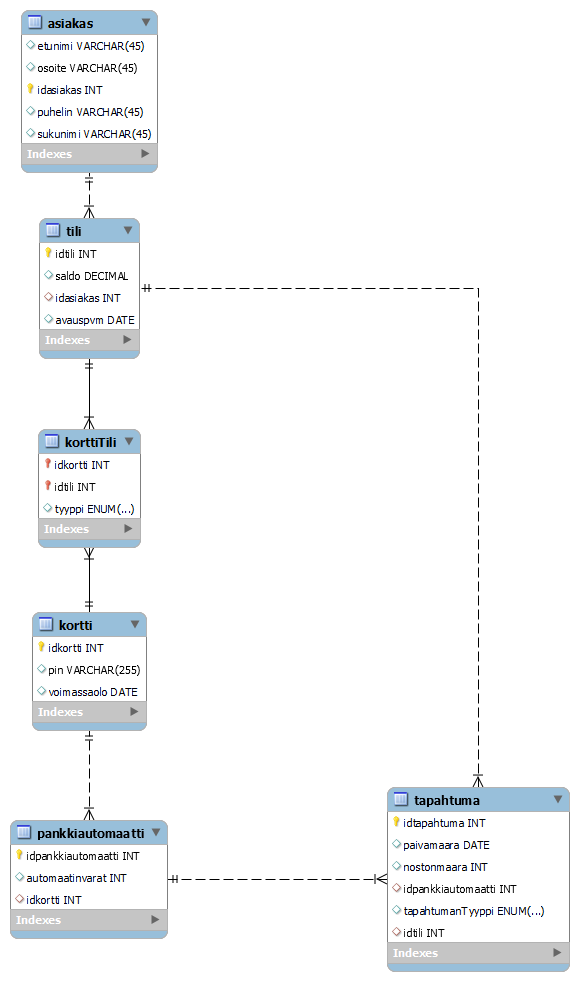

# Pankkiautomaatti – Ohjelmistokehityksen Projekti

## 📌 Projektin kuvaus
Tämä projekti on osa ohjelmistokehityksen kurssia, ja sen tavoitteena on kehittää pankkiautomaattisovellus, joka mahdollistaa asiakkaiden kirjautumisen tililleen sekä peruspankkitoiminnot, kuten saldon tarkistamisen ja rahan nostamisen.

Projektin keskeiset vaatimukset sisältävät tietokannan toteutuksen, REST API -rajapinnan sekä Qt-työpöytäsovelluksen.

## 🔧 Käytetyt teknologiat
Projektissa käytetään seuraavia teknologioita:
- **Tietokanta**: MySQL / MariaDB
- **Backend**: Node.js, Express.js (REST API)
- **Frontend**: Qt (Qt Network -moduuli käytössä kommunikointiin API:n kanssa)

## 🏗️ Projektin rakenne
Projektin toteutus koostuu seuraavista osista:

1. **Tietokanta**
   - Sisältää asiakkaat, tilit ja kortit.
   - PIN-koodit tallennetaan salattuna (bcrypt).
   - Credit-korteilla on luottoraja.
   - Debit-kortilla ei voi nostaa rahaa yli saldon.
   
2. **REST API (Node.js, Express.js)**
   - Toteuttaa pankkiautomaatin tarvitseman liiketoimintalogiikan.
   - Kommunikoi tietokannan kanssa ja välittää tietoa Qt-sovellukselle.
   - Tukee CRUD-operaatioita kaikille tietokannan tauluille.
   
3. **Qt-sovellus (Frontend)**
   - Graafinen käyttöliittymä, joka kommunikoi REST API:n kanssa HTTP-protokollan avulla.
   - Mahdollistaa kirjautumisen kortin ID:llä ja PIN-koodilla.
   - Tukee perustoimintoja: saldon tarkistus, rahan nosto.
   - Tukee myös credit-korttia ja vaihtoehtoista nostosummaa.

## 📜 Sovelluksen toiminta
1. **Käynnistys**: Qt-sovellus avaa aloitusnäytön.
2. **Kirjautuminen**: Käyttäjä syöttää kortin ID:n ja PIN-koodin.
3. **PIN-koodin käsittely**:
   - Oikea PIN: Pääkäyttöliittymä avautuu.
   - Väärä PIN: Ilmoitus virheellisestä koodista, 3 virheellistä yritystä lukitsee kortin.
4. **Toiminnot**:
   - Saldon tarkistus.
   - Rahannosto: itse valittu summa.
   - Kortin tyypin valinta (debit/credit).
   - Tilitapahtumien tarkastelu.

## 📊 ER-kaavio
Alla on projektin ER-kaavio:

## 📄 Projektiposteri

## 📄 Lisenssi
Tämä projekti on toteutettu osana opiskelijakurssia, eikä sitä ole tarkoitettu kaupalliseen käyttöön.

